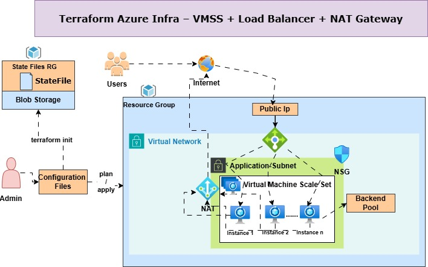

<div align="center">

# 🚀 Terraform Azure Infrastructure
## VMSS + Load Balancer + NAT Gateway


**Provision a highly available and scalable Azure infrastructure using Terraform.**

</div>

---

# 📖 Overview

This project demonstrates how to deploy a complete Azure infrastructure using **Terraform Infrastructure as Code (IaC)**.

The deployment includes networking, compute, security, load balancing, outbound internet connectivity, and remote Terraform state management.

---

# 🏗️ Architecture

<p align="center">

</p>

---

# ✨ Features

- 🚀 Infrastructure as Code (Terraform)
- ☁️ Azure Virtual Machine Scale Set (VMSS)
- ⚖️ Azure Standard Load Balancer
- 🌍 NAT Gateway for Outbound Connectivity
- 🔐 Network Security Group (NSG)
- 🌐 Virtual Network & Application Subnet
- 📦 Azure Blob Storage Remote State
- 📈 Scalable Infrastructure
- 🔄 Easy Deployment
- 🛡️ Secure Networking

---

# 📂 Project Structure

```text
.
├── backend.tf
├── provider.tf
├── variables.tf
├── terraform.tfvars
├── main.tf
├── outputs.tf
├── modules/
│   ├── resource-group/
│   ├── network/
│   ├── vmss/
│   ├── load-balancer/
│   ├── nat-gateway/
│   └── storage/
└── images/
    └── architecture.png
```

---

# ⚙️ Deployment

### Initialize

```bash
terraform init
```

### Validate

```bash
terraform validate
```

### Plan

```bash
terraform plan
```

### Apply

```bash
terraform apply
```

### Destroy

```bash
terraform destroy
```

---

# 🛠️ Azure Resources

| Resource | Purpose |
|----------|---------|
| Resource Group | Organizes Azure resources |
| Virtual Network | Network infrastructure |
| Application Subnet | Hosts VM Scale Set |
| VM Scale Set | Scalable virtual machines |
| Load Balancer | Distributes incoming traffic |
| Backend Pool | Contains VMSS instances |
| NAT Gateway | Outbound internet connectivity |
| NSG | Network Security |
| Public IP | Public access |
| Storage Account | Terraform Remote State |

---

# 💻 Technologies

- Terraform
- Microsoft Azure
- Azure VM Scale Set
- Azure Load Balancer
- Azure NAT Gateway
- Azure Virtual Network
- Azure Storage Account
- Azure Blob Storage
- Network Security Groups

---

# 📸 Screenshot

> Replace the image below with your own architecture diagram.

<p align="center">

</p>

---

# 🌟 If you found this project useful

⭐ Star this repository

🍴 Fork it

💙 Happy Learning!

---

<div align="center">

Made with ❤️ using Terraform & Microsoft Azure

</div>